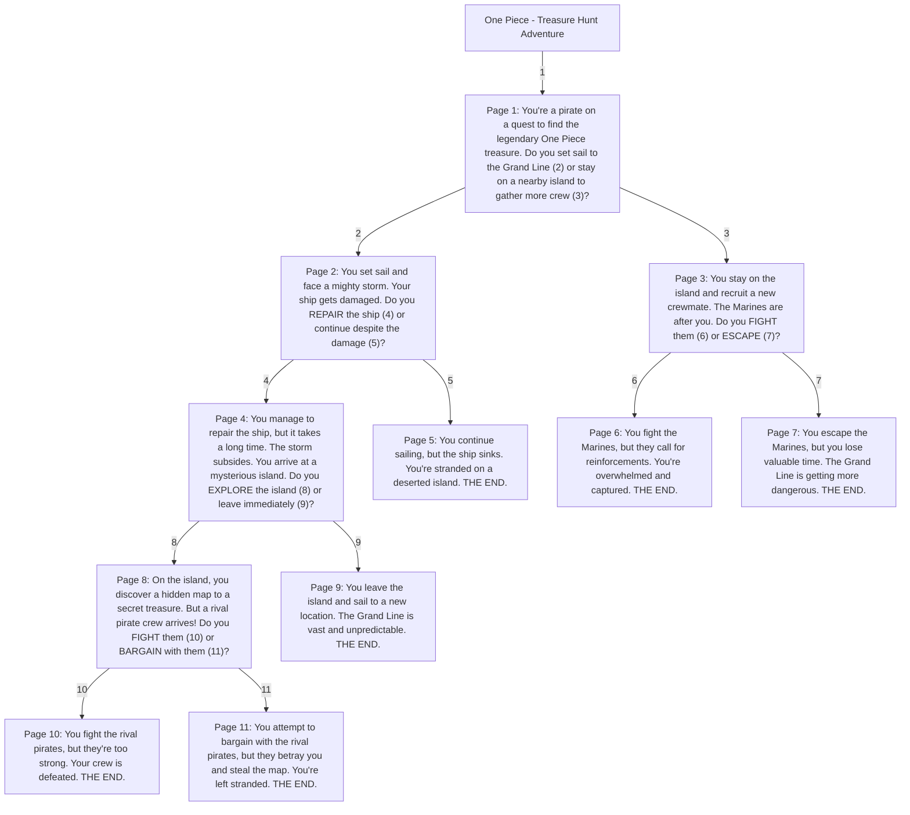
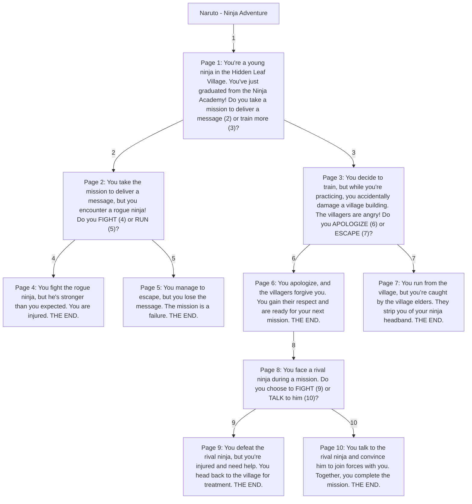
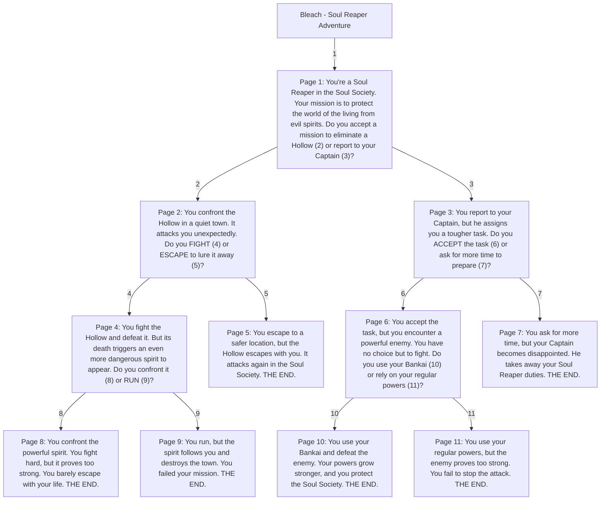

# hello

## subsection

```mermaid
flowchart TD
    start["One Piece - Treasure Hunt Adventure"] -- 1 --> page1["Page 1: You're a pirate on a quest to find the legendary One Piece treasure. Do you set sail to the Grand Line (2) or stay on a nearby island to gather more crew (3)?"]
    page1 -- 2 --> sail["Page 2: You set sail and face a mighty storm. Your ship gets damaged. Do you REPAIR the ship (4) or continue despite the damage (5)?"]
    page1 -- 3 --> island["Page 3: You stay on the island and recruit a new crewmate. The Marines are after you. Do you FIGHT them (6) or ESCAPE (7)?"]
    sail -- 4 --> repair["Page 4: You manage to repair the ship, but it takes a long time. The storm subsides. You arrive at a mysterious island. Do you EXPLORE the island (8) or leave immediately (9)?"]
    sail -- 5 --> sink["Page 5: You continue sailing, but the ship sinks. You're stranded on a deserted island. THE END."]
    island -- 6 --> fight_marines["Page 6: You fight the Marines, but they call for reinforcements. You're overwhelmed and captured. THE END."]
    island -- 7 --> escape_marines["Page 7: You escape the Marines, but you lose valuable time. The Grand Line is getting more dangerous. THE END."]
    repair -- 8 --> explore["Page 8: On the island, you discover a hidden map to a secret treasure. But a rival pirate crew arrives! Do you FIGHT them (10) or BARGAIN with them (11)?"]
    repair -- 9 --> leave_island["Page 9: You leave the island and sail to a new location. The Grand Line is vast and unpredictable. THE END."]
    explore -- 10 --> fight_pirates["Page 10: You fight the rival pirates, but they're too strong. Your crew is defeated. THE END."]
    explore -- 11 --> bargain_pirates["Page 11: You attempt to bargain with the rival pirates, but they betray you and steal the map. You're left stranded. THE END."]
```

```mermaid
flowchart TD
    start["Naruto - Ninja Adventure"] -- 1 --> page1["Page 1: You're a young ninja in the Hidden Leaf Village. You've just graduated from the Ninja Academy! Do you take a mission to deliver a message (2) or train more (3)?"]
    page1 -- 2 --> mission["Page 2: You take the mission to deliver a message, but you encounter a rogue ninja! Do you FIGHT (4) or RUN (5)?"]
    page1 -- 3 --> train["Page 3: You decide to train, but while you're practicing, you accidentally damage a village building. The villagers are angry! Do you APOLOGIZE (6) or ESCAPE (7)?"]
    mission -- 4 --> fight_rogue["Page 4: You fight the rogue ninja, but he's stronger than you expected. You are injured. THE END."]
    mission -- 5 --> fail_mission["Page 5: You manage to escape, but you lose the message. The mission is a failure. THE END."]
    train -- 6 --> apologize["Page 6: You apologize, and the villagers forgive you. You gain their respect and are ready for your next mission. THE END."]
    train -- 7 --> escape_village["Page 7: You run from the village, but you’re caught by the village elders. They strip you of your ninja headband. THE END."]
    apologize -- 8 --> rival_ninja["Page 8: You face a rival ninja during a mission. Do you choose to FIGHT (9) or TALK to him (10)?"]
    rival_ninja -- 9 --> fight_rival["Page 9: You defeat the rival ninja, but you're injured and need help. You head back to the village for treatment. THE END."]
    rival_ninja -- 10 --> talk_rival["Page 10: You talk to the rival ninja and convince him to join forces with you. Together, you complete the mission. THE END."]
```

```mermaid
flowchart TD
    start["Bleach - Soul Reaper Adventure"] -- 1 --> page1["Page 1: You're a Soul Reaper in the Soul Society. Your mission is to protect the world of the living from evil spirits. Do you accept a mission to eliminate a Hollow (2) or report to your Captain (3)?"]
    page1 -- 2 --> hollow["Page 2: You confront the Hollow in a quiet town. It attacks you unexpectedly. Do you FIGHT (4) or ESCAPE to lure it away (5)?"]
    page1 -- 3 --> captain["Page 3: You report to your Captain, but he assigns you a tougher task. Do you ACCEPT the task (6) or ask for more time to prepare (7)?"]
    hollow -- 4 --> fight_hollow["Page 4: You fight the Hollow and defeat it. But its death triggers an even more dangerous spirit to appear. Do you confront it (8) or RUN (9)?"]
    hollow -- 5 --> escape_hollow["Page 5: You escape to a safer location, but the Hollow escapes with you. It attacks again in the Soul Society. THE END."]
    captain -- 6 --> accept_task["Page 6: You accept the task, but you encounter a powerful enemy. You have no choice but to fight. Do you use your Bankai (10) or rely on your regular powers (11)?"]
    captain -- 7 --> time_to_prepare["Page 7: You ask for more time, but your Captain becomes disappointed. He takes away your Soul Reaper duties. THE END."]
    fight_hollow -- 8 --> confront_spirit["Page 8: You confront the powerful spirit. You fight hard, but it proves too strong. You barely escape with your life. THE END."]
    fight_hollow -- 9 --> run_spirit["Page 9: You run, but the spirit follows you and destroys the town. You failed your mission. THE END."]
    accept_task -- 10 --> bankai["Page 10: You use your Bankai and defeat the enemy. Your powers grow stronger, and you protect the Soul Society. THE END."]
    accept_task -- 11 --> regular_powers["Page 11: You use your regular powers, but the enemy proves too strong. You fail to stop the attack. THE END."]
```
